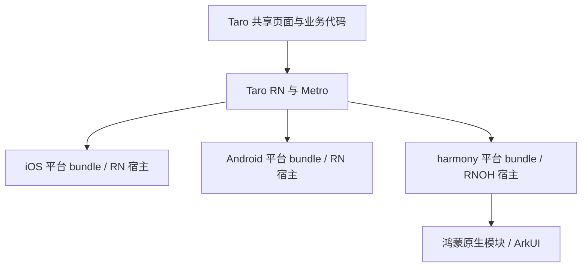

# 鸿蒙采用 React Native 模式的可行性调研

历史调研记录：当前独立宿主实现与操作说明见 [鸿蒙 RN 宿主](../apps/harmonyos-rn/README.md)。下文保留实施前的调研语境。

调研日期：2026-10-07。本次核对仓库配置、已安装 Taro 包源码及官方资料；未安装新依赖、未改运行链路、未执行 RNOH 构建或设备测试。

## 结论

可以探索通过 React Native for OpenHarmony（RNOH）承载共享 RN 页面。Taro 已公开鸿蒙 RN 接入路线，因此不需要从零设计 Taro 到鸿蒙 RN 的桥接；但现有 RN 0.72.5 + Expo 49 组合不能直接认定兼容，仍需独立宿主、Metro 解析适配及原生依赖核验。[Taro 官方鸿蒙 RN 方案](https://docs.taro.zone/docs/react-native-harmony)

建议保留当前 `harmony_cpp` 链路，先做独立 RNOH POC，按“原生 RN 页面 → Taro 首页 → 路由和基础能力 → 业务原生能力”逐步验收。目标是共享页面与业务代码、统一 RN 开发模式；鸿蒙仍有自己的 HAP、原生模块与平台 bundle。

## 当前工程与目标形态

| 项目 | 当前实现 | RN 统一模式需要的变化 |
| --- | --- | --- |
| 共享页面 | `apps/taro/src`，Taro 4.2.1、React 18.2 | 优先继续复用；平台差异通过适配处理 |
| iOS / Android | RN 0.72.5、Expo 49、Hermes，关闭新架构 | POC 阶段维持当前组合 |
| 鸿蒙 | Taro Vite `harmony_cpp` 编译注入 `apps/harmonyos/entry` | 新增独立 RNOH 宿主及其运行时依赖 |
| JS 构建 | Taro Metro transformer，目前平台为 ios/android | 增加 harmony 平台解析、RNOH resolver 与资源处理 |
| 原生能力 | RN 三方库及 Expo 模块 | 按能力选择鸿蒙适配包或自行实现 |

证据：`apps/taro/package.json`、`apps/taro/config/index.ts`、`apps/taro/metro.config.js`、`pnpm-workspace.yaml`、`apps/harmonyos/entry/oh-package.json5`。此前 iOS/Android 编译运行记录见 [RN 0.72.5 迁移验证](react-native-0.72.5-migration.md)，属于既有记录，本次未复测。

现有 Taro `harmony_cpp` 与 RNOH 的 C-API 架构是两个不同运行时。前者使用 Taro 鸿蒙编译器和 `@taro-oh/library`；后者承载 RN 组件。选择 RN 并不意味着鸿蒙底层不再使用 ArkUI C-API。[Taro C-API 文档](https://docs.taro.zone/docs/harmony/c-api)、[RNOH 三方库 C-API 说明](https://github.com/react-native-oh-library/usage-docs/blob/master/zh-cn/capi-architecture.md)

## 已确认的接入条件与风险

### 1. 版本相同不能替代兼容验证

RNOH 官方仓库资料列有基于 RN 0.72.5 的发行分支，适合作为对齐已有宿主的调查起点；本轮无法完整取得最新发行说明，不能据此声称 0.72 是当前最新版或 0.77 已满足本工程生产条件。实施前须锁定具体发行 tag、JS 包、HAR、Hermes、SDK 与 ABI 组合。[RNOH 官方仓库说明](https://gitee.com/openharmony-sig/ohos_react_native/blob/master/README_zh.md)

Taro 4.2.1 的已安装 `components-rn`、`router-rn` 等包仍声明 RN `^0.73.1`；本工程通过精准 peer 例外和 Metro overrides 适配到 0.72.5。因此现有组合属于仓库维护的兼容方案，iOS/Android 跑通不等于鸿蒙也能直接加载。首个 POC 优先核实 0.72.5 对应 RNOH 分支，暂不把三端 RN 升级混入实验。

现有 iOS/Android 关闭新架构的设置也不能直接照搬到 RNOH。鸿蒙的组件与原生模块实现要以选定 RNOH 版本的 Fabric/TurboModule 合同为准；Debug JS 和 Release 内嵌 JS 分别验证，如生成 Hermes 字节码则另核对编译器与运行时匹配。[RNOH 接口说明](https://gitee.com/openharmony-sig/ohos_react_native/blob/master/docs/zh-cn/API接口说明.md)

### 2. Metro 需要保留两层解析能力

Taro 官方接入页使用 `platform=harmony`。本工程仍以 `TARO_ENV=rn` 进入 Taro RN 编译链，不能用 `harmony_cpp` 代替 Metro 的 harmony 平台；宿主 moduleName 应与当前 `rn.appName: 'HybridApp'` 一致。[Taro 官方鸿蒙 RN 方案](https://docs.taro.zone/docs/react-native-harmony)

本地 `@tarojs/rn-supporter/dist/Support.js` 的 `getMetroConfig(opt, toMergeConfig)` 会读取第二参数的 `resolver.resolveRequest`，再用 Taro resolver 包装它。这提供了组合入口：RNOH resolver 作为底层 delegate，外层保留 Taro 的入口、alias、样式与扩展名处理，最终再合并仓库 `watchFolders` 和 `blockList`。这是依据本地源码提出的接法，尚未用选定 RNOH 包验证；只做普通 `mergeConfig` 并让后者覆盖 resolver 可能丢失另一层能力。

验收时分别检查 `react-native`、其内部路径、三方库鸿蒙 alias、`.harmony.tsx`、`.rn.tsx`、Sass 与图片，确认实际解析文件；采用冷缓存 bundle 和设备加载，不能只检查配置可执行。

### 3. Expo 是主要障碍，最小页面也要检查启动依赖

Taro 官方鸿蒙 RN 页面提示部分依赖 Expo 的组件/API 缺少支持。此次未取得本工程 Expo 49 全套模块可在鸿蒙运行的官方适配证据，需要逐模块确认，不能把 iOS/Android Expo 安装流程照搬。[Taro 官方限制说明](https://docs.taro.zone/docs/react-native-harmony)

本地源码进一步显示：

- `@tarojs/runtime-rn/dist/app.js` 实际渲染 `TCNProvider`；`components-rn` 的 Provider 导入 Ant Design RN provider，最小首页也经过该包装。
- `@tarojs/taro-rn/dist/index.js` 聚合 `api` 与 `lib`；`lib/index.js` 重导出全部 API，媒体、文件、传感器等实现有 Expo 导入。
- Metro 当前启用 `inlineRequires`，会影响求值时机，但不能作为未使用能力就一定不会报错的保证。

以上说明需要跟踪最小首页的模块解析与求值链，并不代表已经观察到鸿蒙启动失败。POC 可以按实际错误增加仅鸿蒙生效的适配或能力裁剪；不能用空实现让验收误以为相机、定位等已支持。

### 4. 三方库需要鸿蒙实现与链接

RNOH 三方库文档提供适配包及 `harmony.alias` 重定向机制；JS 包安装不代表原生实现已注册。应逐库核对适配版本、HAR、Codegen 和原生链接步骤。[三方库总览](https://github.com/react-native-oh-library/usage-docs/blob/master/zh-cn/README.md)、[补丁与 alias 机制](https://github.com/react-native-oh-library/usage-docs/blob/master/zh-cn/patch.md)

| 优先级 | 本工程依赖 | 核验重点 |
| --- | --- | --- |
| 启动与导航 | safe-area-context、gesture-handler、screens、root-siblings、Ant Design provider | Provider 初始化、路由、返回键、事件和安全区 |
| 基础 API | async-storage、device-info、netinfo、clipboard | 实际调用是否有鸿蒙原生实现 |
| 页面组件 | svg、webview、pager-view、picker、slider、maps | 对应版本、C-API 组件兼容与资源 |
| 业务能力 | CameraRoll、定位、图片处理及各 Expo 模块 | 权限、系统 API、生命周期及替代方案 |

RNOH 的 C-API 文档说明该架构默认开启，并限制混合模式中 ArkTS View 为叶子节点；旧 ArkTS 架构后续不再演进。选择组件适配包时应确认其容器/叶子节点及架构类型。[官方架构说明](https://github.com/react-native-oh-library/usage-docs/blob/master/zh-cn/capi-architecture.md)

## 推荐 POC 与验收

以下是后续实施建议，当前没有新增这些宿主、配置或命令。

| 阶段 | 工作 | 通过条件 |
| --- | --- | --- |
| A：锁定环境 | 选择明确的 RNOH 发行 tag、JS/HAR、SDK/API、Hermes、模拟器/真机 ABI；确定 Command Line Tools 构建方式 | 环境清单可复现，原生依赖包含目标 ABI；与当前 API 26 环境是否兼容有明确结果 |
| B：纯 RN 宿主 | 独立实验宿主，仅使用 React、View、Text 和点击计数 | HAP 构建安装成功；harmony 平台 bundle 加载；`Platform.OS` 正确；Debug 刷新与 Release 离线启动通过 |
| C：Taro 首页 | 接 Taro transformer/resolver，加载现有 Hello world 首页 | App/Page 生命周期、Sass、文本、点击正常；记录并解决真实 Provider/Expo 启动问题 |
| D：基础能力 | 两页导航、返回键、安全区、输入与滚动、网络、存储、图片 | 各能力设备实测，无模块缺失；保留依赖映射和日志 |
| E：迁移决策 | 按实际业务补齐相机、定位、文件等；比较性能和维护成本 | 必需能力覆盖，iOS/Android 与受影响 H5/微信构建回归完成，再决定是否替换 C-API 链路 |

实验宿主可独立放在 `apps/harmonyos-rn`，避免 Taro `harmony_cpp` 构建覆盖生成文件；建议实验产物使用 `dist/harmony-rn/`，缓存使用 `.cache/harmony-rn/`，与现有交付目录分开。若实施，需要同步相应规则、脚本、忽略配置与软件要求。

## 证据边界

- Taro 官方鸿蒙 RN 页面仍含白名单、旧 IDE 与 Preview SDK 描述，只用于确认接入路线和已披露限制，不把它当作当前安装清单。
- RNOH Gitee 页面本轮多次超时；部分发行分支信息来自官方页面的搜索索引，未完成最新发布状态核验。不引用二手文章来补齐版本、SDK 或 ABI 结论。
- 当前仓库已有 C-API 和 iOS/Android 运行记录，不构成本次 RNOH 运行证据。
- 此次只新增调研文档。是否能完成三端 RN 页面复用，需要上述 POC 给出实测结果。
